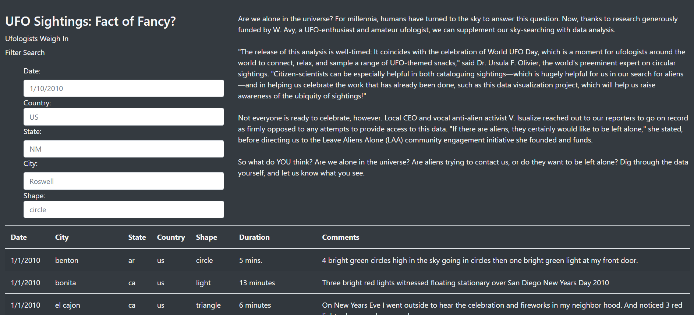

# UFOs
# Overview
The purpose of this project was to help Dana build a responsive website to search for UFOs. She also wanted it to be a blog where she could write articles about UFOs.

We worked together to find the right format for the website. We tested different types of filters, sizes of the boxes for each section of the site, and mobile responsiveness of the site.

# Results
The final product allows the visitor of the site to be able to search and learn about UFO sightings around the world.

Some of the modifications include:

* Adding additional criteria for filtering.
* Placing the filter options up closer to the article and headings.
* Placing the table underneath the upper portion of the page so that the table reached across the entire page.
* Making the filters all the same width for visual aesthetics.

# Summary
Over all she is very pleased with the site and is looking forward to writing more articles and locating more sightings to add to the data set. One thing she did notice is that her hometown and Roswell, New Mexico are not listed in her data set. She is concerned about the lack of data for each town as they both see a similar number of sightings each year. She is planning to visit both and see if she can get more information on the subject. She will also interview the townsfolks for a potential article.

Finally, the next steps will be for her to write and add additional articles to the site.  Make a repository of articles that visitor can search by key words to find exactly what they are looking for from the site.

We will continue to refine our code to ensure that the site and fully automated.